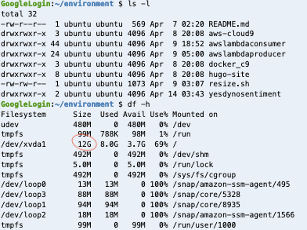
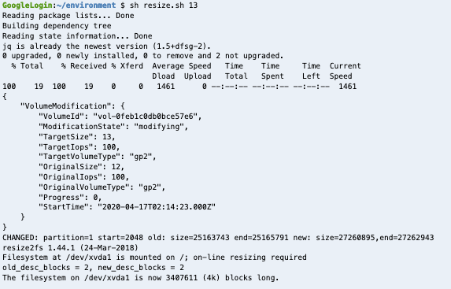
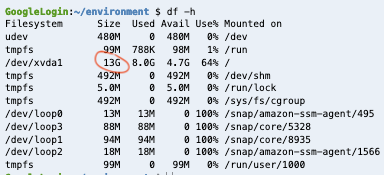

# aws-cloud9 resize environment volume
aws-cloud9 resize volume


#### Orginal disk size and ls. 



#### Expand.   

```
sh resize.sh 13
```


#### Expanded volume.   



#### No reboot is required.  
